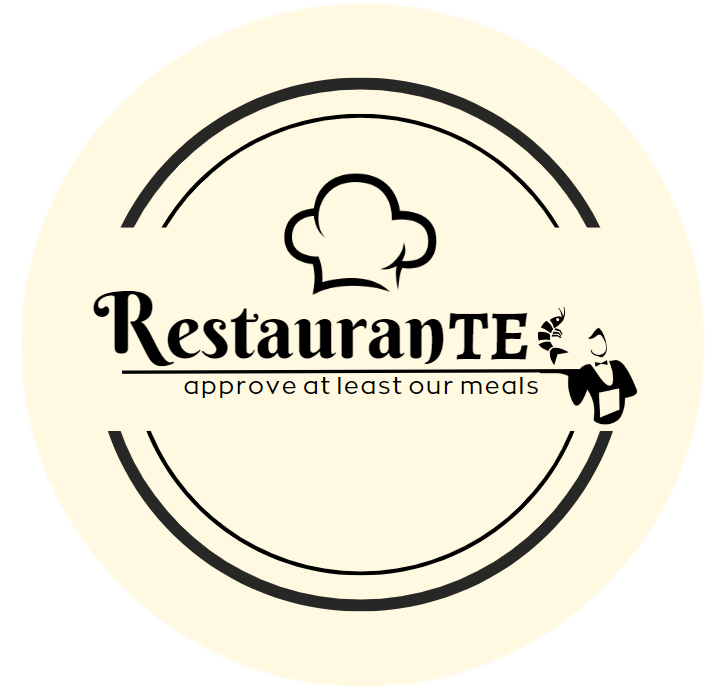

# RestauranTEC

<p align="center">
  
</p>

<p align="center">

  
  
  

</p>

## Description
This is an expert system that generates restaurant recommendations based on the preferences given by the user. It is completely made with prolog using logical programming paradigm. 

RestauranTEC was developed as the second [project](docs/requirements.pdf) of the CE3104 "Compiler and Interpreter Languages" course of the <a href="https://www.tec.ac.cr/programas-academicos/licenciatura-ingenieria-computadores">Computer Engineering</a> career, <a href="https://www.tec.ac.cr">Instituto Tecnológico de Costa Rica</a>. 

Example of a conversation with RestauranTEC:

```
      RestauranTEC: Hola!!! ¿Qué se te antoja comer hoy?
      Usuario: Hoy quiero comer pizza.
      RestauranTEC: ¿Algún tipo de pizza especial?
      Usuario: Jamón y queso, y de tomar 4 cervezas.
      RestauranTEC: ¿Para cuantas personas quieres tu pizza?
      Usuario: Somos 4 personas.
      RestauranTEC: ¿En qué lugar se te antoja comer?
      Usuario: Me gustaría algo cerca de San Pedro, como a las 6pm.
      RestauranTEC: Nuestra sugerencia es: Restaurante Bella Italia que se ubica 300m Sur de la
      entrada principal de la Universidad de Costa Rica.
      Su reservación ha sido tramitada.
      Recuerde: No se permiten mascotas. La vestimenta es formal.
```

## Requisites

* [Prolog](https://www.swi-prolog.org/download/stable)


## How to use?

For a detailed guide of how to use this program you can see the [user's manual](docs/user_manual.pdf) or the [technical documentation](docs/technical_doc.pdf) if you want to know more about how this program works.
